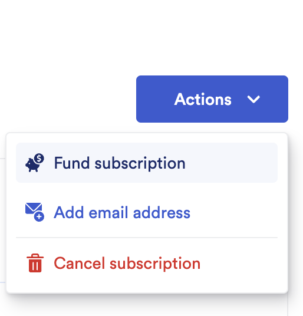
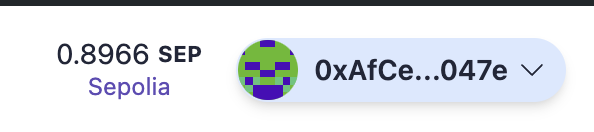

# Scaffold-ETH 2로 간단한 Oracle 사용 해보기

## 🚩 Mission 5. Oracle 사용하기

이번 단계에서는 Oracle을 사용하여 스마트 계약과 외부 데이터를 연결하는 방법에 대해 알아보겠습니다. Oracle은 블록체인 외부의 데이터를 스마트 계약에 전달하는 서비스로, 이를 통해 블록체인과 외부 세계 간의 데이터 통신을 가능하게 합니다.

Oracle을 사용하면 예를 들어 실시간 가격 정보, 날씨 데이터, 결과를 확인해야 하는 경마 등의 정보를 스마트 계약에서 사용할 수 있습니다.

> 🔥 이번 미션은 총 3개의 파트로 구성 되어있으며 파트 1과 파트 2에서는 chainlink의 VRF기능을 사용하여 랜덤값을 가져오는 방법을 파트 3에서는 APIConsumer를 사용하여 코인의 시세를 가져오는 예제를 구현해볼 예정입니다.

> Chainlink VRF 사용시 Subscription이 필요하므로 이번 미션에서는 hardhat체인 말고 sepolia testnet에서 직접 실행해볼 예정입니다.<br/> 만일 hardhat에서 실행하고자 한다면 Chainlink VRF의 개발문서를 참고하면 됩니다.<br /> <br /> [[Chainlink VRF Docs]](https://docs.chain.link/vrf)

---

## 🚩 Step 1. 환경

Scaffod-ETH 2 프로젝트 생성 및 의존성 설치

=> 새로운 프로젝트를 생성할지 만들어놓은 프로젝트를 clone해갈지 추후 결정

```sh
git clone https://github.com/scaffold-eth/scaffold-eth-2.git oracle/part1
cd oracle/part1
yarn install
```

터미널에서 프론트엔드 시작하기

```sh
yarn start
```

세 번째 터미널에서 스마트 계약 배포하기

```sh
yarn deploy --network sepolia

# 아래 구문을 통해 언제든지 새로운 스마트 계약을 배포할 수 있다.
yarn deploy --network sepolia --reset
```

📱 http://localhost:3000 으로 접속해서 애플리케이션 열기

---

## 🚩 Step 2. Subscription과 Fund

> ⛽️ Chainlink VRF를 사용하기 전에 Subscription을 생성하고 Fund를 해야한다.<br /> [[sub]](https://vrf.chain.link/)

## 

> 1. chainlink에 회원가입을 한다
> 2. VRF Subscription 페이지(위의 링크)로 들어간후 create subscription으로 자신의 subscription을 만든다.
> 3. 만들어진 Subscription으로 들어간후 ID값을 복사한다.
> 4. packages/hardhat의 env파일의 subscription ID를 채워 준다.
>    
> 5. 컨트랙트들을 배포해준다.
> 6. 다시 Chainlink Subscription Management페이지로 돌아와 자신의 Subscription에 Fund를 넣어준다.
>    
> 7. 프론트엔드를 실행하여 예제를 살펴본다.

---

## 🚩 Step 3. 프론트엔드

> `packages/nextjs/scaffold.config.ts`의 `targetNetwork`를 `chains.sepolia`로 변경한다.


> 프론트엔드에서 제대로 네트워크가 설정되었는지 볼 수 있다. (http://localhost:3000):



> 공공 테스트넷에 배포되었기 때문에, 이제 본인 소유의 지갑이나 burner 지갑에 연결해야한다. `burner wallets`은 오직 `hardhat`에서만 사용 가능하기 때문에 모든 체인에서 사용할 수 있도록 `packages/nextjs/scaffold.config.ts`의 `onlyLocalBurnerWallet`를 false로 변경한다.


> 💬 힌트: transfer 페이지의 로딩 속도를 높이려면 packages/nextjs/app/transfers/page.tsx에서 useScaffoldEventHistory에 전달되는 fromBlock을 계약이 배포된 blocknumber - 10으로 업데이트해볼 수 있다.

```typescript
// 예시
const { data: transferEvents, isLoading } = useScaffoldEventHistory({
  contractName: "YourCollectible",
  eventName: "Transfer",
  // 여기서 n은 BigInt를 나타낸다.
  // 이 블록 번호를 찾으려면 Etherscan에서 배포 된 계약 주소를 검색하고 Contract Creation 트랜잭션 라인을 찾는다.
  fromBlock: 3750241n,
});
```

NextJS 애플리케이션을 배포한다.

```shell
yarn vercel
```

> Vercel에 배포하려면 로그인(이메일, Github 등) 후 기본 옵션을 사용하면 된다. Vercel이 공용 URL을 제공한다.

> 동일한 프로덕션 URL에 재배포하려면 yarn vercel --prod 명령을 실행한다. --prod 플래그를 생략하면 미리보기/테스트 URL로 배포된다.

⚠️ 애플리케이션이 잘 작동되는지 자동 테스트를 실행해보자.

```shell
yarn test
```

#### [프로덕션 급 애플리케이션을 위한 서드파티 서비스 구성]

기본적으로, Scaffold-ETH 2는 Alchemy와 Etherscan과 같은 인기 있는 서비스에 대한 사전 정의된 API 키를 제공한다. 이를 통해 이러한 서비스에 등록할 필요 없이 애플리케이션을 더 쉽게 개발하고 테스트할 수 있다.
이 기능은 SpeedRunEthereum을 완료하는 데 유용하다.

프로덕션 급 애플리케이션의 경우, 속도 제한 문제를 방지하기 위해 자체 API 키를 얻는 것이 좋.

🔷 ALCHEMY_API_KEY 변수는 `packages/hardhat/.env` 및 `packages/nextjs/.env.local`에 설정한다. Alchemy 대시보드에서 API 키를 생성할 수 있다.

📃 ETHERSCAN_API_KEY 변수는 `packages/hardhat/.env`에 설정한다. API 키는 여기에서 얻을 수 있다.

💬 힌트: 라이브 애플리케이션의 경우 Vercel/시스템 환경 구성에 env를 저장하고 로컬 테스트의 경우 .env.local을 사용하는 것이 좋다.
