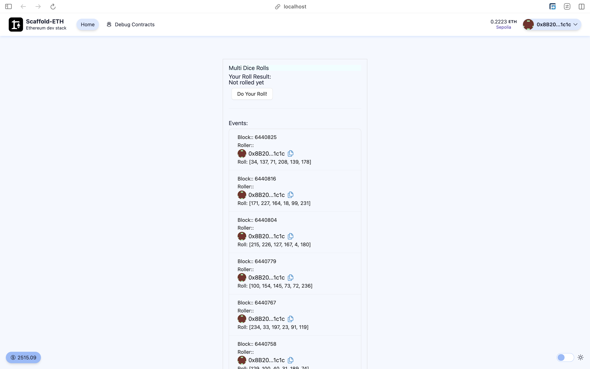
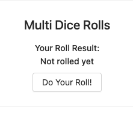

# Scaffold-ETH 2로 간단한 Oracle 사용 해보기

## 🚩 Mission 5. Oracle 사용하기

<h4 align="center">
  <a href="https://docs.scaffoldeth.io">Documentation</a> |
  <a href="https://scaffoldeth.io">Website</a>
</h4>

> 이 스마트 계약을 기반으로 한 분산 애플리케이션을 구축하는 데 필요한 모든 것입니다.

> 이 튜토리얼은 Scaffold-ETH와 Chainlink 기술을 통합하는 방법에 대한 시리즈의 **PART 2**입니다.

> 이 튜토리얼에서는 하나의 계약이 동시에 여러 무작위 기반 요청을 처리하는 **Chainlink VRF**(Verifiable Randomness)의 고급 사용 사례를 학습합니다.

> 코드가 해당 사용 사례에 맞게 간소화되었습니다. 더 많은 UI 옵션과 기본 VRF 예제가 포함된 VRF 스타터 키트는 **PART 1**

> 🧪 스마트 계약에 적응하는 프론트엔드로 Solidity를 빠르게 실험해보세요:


> Chainlink VRF 사용시 Subscription이 필요하므로 이번 미션에서는 hardhat체인 말고 sepolia testnet에서 직접 실행해볼 예정입니다.<br/> 만일 hardhat에서 실행하고자 한다면 Chainlink VRF의 개발문서를 참고하면 됩니다.<br /> <br /> [[Chainlink VRF Docs]](https://docs.chain.link/vrf)

---

## 🚩 Step 1. 환경

Scaffod-ETH 2 프로젝트 생성 및 의존성 설치

=> 새로운 프로젝트를 생성할지 만들어놓은 프로젝트를 clone해갈지 추후 결정

```sh
git clone https://github.com/scaffold-eth/scaffold-eth-2.git oracle/part2
cd oracle/part2
yarn install
```

터미널에서 프론트엔드 시작하기

```sh
yarn start
```

세 번째 터미널에서 스마트 계약 배포하기

```sh
yarn deploy --network sepolia

# 아래 구문을 통해 언제든지 새로운 스마트 계약을 배포할 수 있다.
yarn deploy --network sepolia --reset
```

📱 http://localhost:3000 으로 접속해서 애플리케이션 열기

---

## 🚩 Step 2. MultiDiceRolls

이 계약은 PART 1의 DiceRolls 계약에서 발전되었습니다. 여러 사용자의 주사위 굴리기를 동시에 추적할 수 있습니다.

주사위 굴리기 요청을 처리하고 오라클 응답을 통해 주사위를 굴려 결과를 제공합니다.

💻 🤓 테스트해 보세요!

> 테스트 하기 전에 계약에 LINK를 충전해야 합니다.

테스트넷 LINK는 [**여기**](https://faucets.chain.link/)에서 받으세요.



> Example UI를 확인하고 주사위를 굴려 보세요:

---

## 🚩 Step 3. 프론트엔드

> `packages/nextjs/scaffold.config.ts`의 `targetNetwork`를 `chains.sepolia`로 변경한다.


> 프론트엔드에서 제대로 네트워크가 설정되었는지 볼 수 있다. (http://localhost:3000):


> 공공 테스트넷에 배포되었기 때문에, 이제 본인 소유의 지갑이나 burner 지갑에 연결해야한다. `burner wallets`은 오직 `hardhat`에서만 사용 가능하기 때문에 모든 체인에서 사용할 수 있도록 `packages/nextjs/scaffold.config.ts`의 `onlyLocalBurnerWallet`를 false로 변경한다.



> 🔍 Solidity 코드 분석:

프론트엔드에서 **Do Your Roll!** 버튼을 클릭 할 때, **MultiDiceRolls** Contract에 있는 `requestRandomRoll()`함수를 호출하여 작성한다.

```typescript
//MultiDiceRolls.sol
 function requestRandomRoll() public {
        uint256 reqId = s_vrfCoordinator.requestRandomWords(VRFV2PlusClient.RandomWordsRequest({
            keyHash: keyHash,
            subId: s_subscriptionId,
            requestConfirmations: requestConfirmations,
            callbackGasLimit: callbackGasLimit,
            numWords: numWords,
            extraArgs: VRFV2PlusClient._argsToBytes(VRFV2PlusClient.ExtraArgsV1({nativePayment: true}))
        }));

        requests[reqId] = msg.sender;
        rollResults[msg.sender].hasRequested = true;
        emit RequestRolled(reqId);
    }
```

> 💬 힌트: transfer 페이지의 로딩 속도를 높이려면 packages/nextjs/app/transfers/page.tsx에서 useScaffoldEventHistory에 전달되는 fromBlock을 계약이 배포된 blocknumber - 10으로 업데이트해볼 수 있다.

```typescript
// 예시
const { data: transferEvents, isLoading } = useScaffoldEventHistory({
  contractName: "YourCollectible",
  eventName: "Transfer",
  // 여기서 n은 BigInt를 나타낸다.
  // 이 블록 번호를 찾으려면 Etherscan에서 배포 된 계약 주소를 검색하고 Contract Creation 트랜잭션 라인을 찾는다.
  fromBlock: 3750241n,
});
```

NextJS 애플리케이션을 배포한다.

```shell
yarn vercel
```

> Vercel에 배포하려면 로그인(이메일, Github 등) 후 기본 옵션을 사용하면 된다. Vercel이 공용 URL을 제공한다.

> 동일한 프로덕션 URL에 재배포하려면 yarn vercel --prod 명령을 실행한다. --prod 플래그를 생략하면 미리보기/테스트 URL로 배포된다.

⚠️ 애플리케이션이 잘 작동되는지 자동 테스트를 실행해보자.

```shell
yarn test
```

#### [프로덕션 급 애플리케이션을 위한 서드파티 서비스 구성]

기본적으로, Scaffold-ETH 2는 Alchemy와 Etherscan과 같은 인기 있는 서비스에 대한 사전 정의된 API 키를 제공한다. 이를 통해 이러한 서비스에 등록할 필요 없이 애플리케이션을 더 쉽게 개발하고 테스트할 수 있다.
이 기능은 SpeedRunEthereum을 완료하는 데 유용하다.

프로덕션 급 애플리케이션의 경우, 속도 제한 문제를 방지하기 위해 자체 API 키를 얻는 것이 좋.

🔷 ALCHEMY_API_KEY 변수는 `packages/hardhat/.env` 및 `packages/nextjs/.env.local`에 설정한다. Alchemy 대시보드에서 API 키를 생성할 수 있다.

📃 ETHERSCAN_API_KEY 변수는 `packages/hardhat/.env`에 설정한다. API 키는 여기에서 얻을 수 있다.

💬 힌트: 라이브 애플리케이션의 경우 Vercel/시스템 환경 구성에 env를 저장하고 로컬 테스트의 경우 .env.local을 사용하는 것이 좋다.

### 🧙‍♂️ 사이드 퀘스트

> 공개 함수로 승자 선택: 최대 점수를 가진 사람을 선택하세요.

> 여러 라운드 지원: 계약 상태를 리셋하고 승자를 기억하세요.

> LINK 출금 기능: LINK 토큰 계약과 상호 작용하여 출금 기능을 구현하세요.
