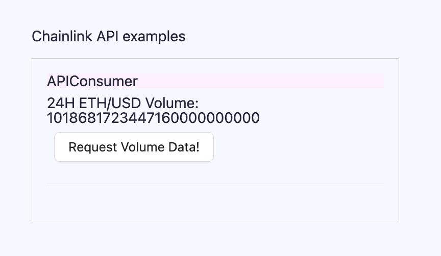
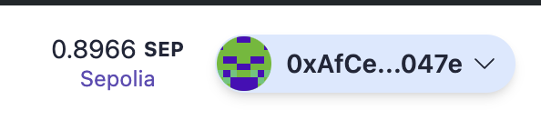
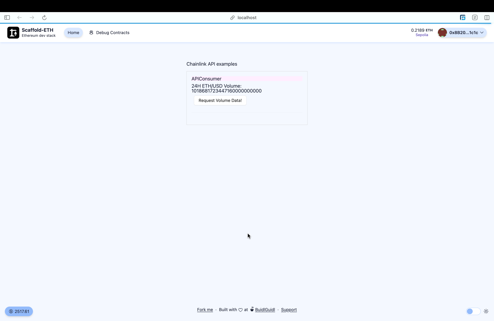
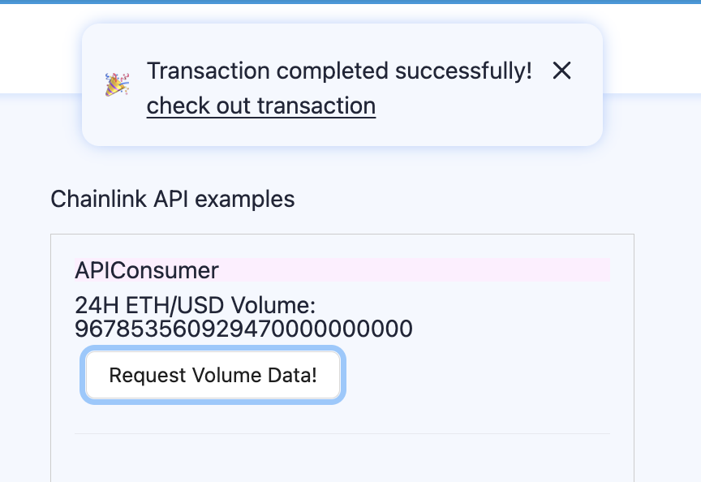

# Scaffold-ETH 2로 간단한 Oracle 사용 해보기

## 🚩 Mission 5. Oracle 사용하기

> 스마트 컨트렉트 기반의 분산형 애플리케이션을 구축하는 데 필요한 모든 것입니다. 이 튜토리얼은 **PART 3**으로, Chainlink 기술을 Scaffold-ETH와 통합하는 방법을 다룹니다. Chainlink VRF에 대해 배우려면 **PART 1**과 **PART 2**를 확인하세요.

> 🔥 이번 미션은 총 3개의 파트로 구성 되어있으며 파트 1과 파트 2에서는 chainlink의 VRF기능을 사용하여 랜덤값을 가져오는 방법을 파트 3에서는 APIConsumer를 사용하여 코인의 시세를 가져오는 예제를 구현해볼 예정입니다.

> Chainlink VRF 사용시 Subscription이 필요하므로 이번 미션에서는 hardhat체인 말고 sepolia testnet에서 직접 실행해볼 예정입니다.<br/> 만일 hardhat에서 실행하고자 한다면 Chainlink VRF의 개발문서를 참고하면 됩니다.<br /> <br /> [[Chainlink VRF Docs]](https://docs.chain.link/vrf)

---

## 🚩 Step 1. 환경

Scaffod-ETH 2 프로젝트 생성 및 의존성 설치

=> 새로운 프로젝트를 생성할지 만들어놓은 프로젝트를 clone해갈지 추후 결정

```sh
git clone https://github.com/scaffold-eth/scaffold-eth-2.git oracle/part3
cd oracle/part3
yarn install
```

터미널에서 프론트엔드 시작하기

```sh
yarn start
```

세 번째 터미널에서 스마트 컨트렉트 배포하기

```sh
yarn deploy --network sepolia

# 아래 구문을 통해 언제든지 새로운 스마트 컨트렉트을 배포할 수 있다.
yarn deploy --network sepolia --reset
```

📱 http://localhost:3000 으로 접속해서 애플리케이션 열기

---

## 🚩 Step 2. APIConsumer

Http Get요청을 사용하여, 데이터 API 요청을 처리하고 오라클 응답을 통해 결과를 제공합니다.

💻 🤓 테스트해 보세요!

> 테스트 하기 전에 컨트렉트에 LINK를 충전해야 합니다.

테스트넷 LINK는 [**여기**](https://faucets.chain.link/)에서 받으세요.



> Example UI를 확인하고 Volumne Data를 가져와 보세요!:

📝 기본적으로 Scaffold-Eth 디버그 UI는 큰 숫자에 대해 특별 처리를 적용합니다. 이는 숫자가 wei 값이라고 가정하고 10 \*\* 18로 나누어 18자리 소수점을 왼쪽으로 이동합니다.

> BTC / ETH 데이터 피드는 정확히 18자리 소수점을 추가합니다. 프론트엔드는 정확히 18자리 소수점이 있다고 가정합니다. 우리가 예상하는 대로 표시됩니다 (이 글을 쓸 때: 1 BTC는 약 11 ETH입니다).

```yaml
우리는 417233000000을 받으며
4172.33000000으로 해석합니다.
```

> 🔍 체인 프로세스 분석:

1. 데이터를 요청할 때 (sendChainlinkRequestTo(oracle, request, fee)) 실제로 Chainlink 오라클 컨트렉트을 호출합니다.

2. 오라클 컨트렉트은 요청을 Chainlink 노드에게 작업으로 제공합니다.

3. Chainlink 노드 (오프체인) 작업을 수행합니다.

4. 요청에 지시 사항을 첨부했으므로,

   1. Chainlink 노드는 HTTP GET 요청을 수행합니다;

   2. 응답에서 필요한 데이터를 "추출"합니다;

   3. 그 데이터를 Chainlink 오라클 컨트렉트에 반환합니다.

---

## 🚩 Step 3. 프론트엔드

> `packages/nextjs/scaffold.config.ts`의 `targetNetwork`를 `chains.sepolia`로 변경한다.


> 프론트엔드에서 제대로 네트워크가 설정되었는지 볼 수 있다. (http://localhost:3000):



> 공공 테스트넷에 배포되었기 때문에, 이제 본인 소유의 지갑이나 burner 지갑에 연결해야한다. `burner wallets`은 오직 `hardhat`에서만 사용 가능하기 때문에 모든 체인에서 사용할 수 있도록 `packages/nextjs/scaffold.config.ts`의 `onlyLocalBurnerWallet`를 false로 변경한다.



> 🔍 Solidity 코드 분석:

프론트엔드에서 **Request Volume Data!** 버튼을 클릭 할 때, **APIConsumer** Contract에 있는 `requestVolumeData()`함수를 호출하여 작성한다.

```typescript
//APIConsumer.sol
function requestVolumeData() public returns (bytes32 requestId) {
        Chainlink.Request memory req = _buildChainlinkRequest(
            jobId,
            address(this),
            this.fulfill.selector
        );

        req._add(
            "get",
            "https://min-api.cryptocompare.com/data/pricemultifull?fsyms=ETH&tsyms=USD"
        );
        req._add("path", "RAW,ETH,USD,VOLUME24HOUR"); // Chainlink nodes 1.0.0 and later support this format

        int256 timesAmount = 10 ** 18;
        req._addInt("times", timesAmount);

        // Sends the request
        return _sendChainlinkRequest(req, fee);
    }
```

이후 연결된 지갑에서 일정의 **Gas Fee**를 지불 후, 성공적으로 트렌젝션이 완료되면 **API Consumer**의 Volume 값이 바뀐다.



> 💬 힌트: transfer 페이지의 로딩 속도를 높이려면 packages/nextjs/app/transfers/page.tsx에서 useScaffoldEventHistory에 전달되는 fromBlock을 컨트렉트이 배포된 blocknumber - 10으로 업데이트해볼 수 있다.

```typescript
// 예시
const { data: transferEvents, isLoading } = useScaffoldEventHistory({
  contractName: "YourCollectible",
  eventName: "Transfer",
  // 여기서 n은 BigInt를 나타낸다.
  // 이 블록 번호를 찾으려면 Etherscan에서 배포 된 컨트렉트 주소를 검색하고 Contract Creation 트랜잭션 라인을 찾는다.
  fromBlock: 3750241n,
});
```

NextJS 애플리케이션을 배포한다.

```shell
yarn vercel
```

> Vercel에 배포하려면 로그인(이메일, Github 등) 후 기본 옵션을 사용하면 된다. Vercel이 공용 URL을 제공한다.

> 동일한 프로덕션 URL에 재배포하려면 yarn vercel --prod 명령을 실행한다. --prod 플래그를 생략하면 미리보기/테스트 URL로 배포된다.

⚠️ 애플리케이션이 잘 작동되는지 자동 테스트를 실행해보자.

```shell
yarn test
```

#### [프로덕션 급 애플리케이션을 위한 서드파티 서비스 구성]

기본적으로, Scaffold-ETH 2는 Alchemy와 Etherscan과 같은 인기 있는 서비스에 대한 사전 정의된 API 키를 제공한다. 이를 통해 이러한 서비스에 등록할 필요 없이 애플리케이션을 더 쉽게 개발하고 테스트할 수 있다.
이 기능은 SpeedRunEthereum을 완료하는 데 유용하다.

프로덕션 급 애플리케이션의 경우, 속도 제한 문제를 방지하기 위해 자체 API 키를 얻는 것이 좋.

🔷 ALCHEMY_API_KEY 변수는 `packages/hardhat/.env` 및 `packages/nextjs/.env.local`에 설정한다. Alchemy 대시보드에서 API 키를 생성할 수 있다.

📃 ETHERSCAN_API_KEY 변수는 `packages/hardhat/.env`에 설정한다. API 키는 여기에서 얻을 수 있다.

💬 힌트: 라이브 애플리케이션의 경우 Vercel/시스템 환경 구성에 env를 저장하고 로컬 테스트의 경우 .env.local을 사용하는 것이 좋다.

### 🧙‍♂️ 사이드 퀘스트

> 컨트렉트를 수정하여 BTC / ETH 가격을 표시하도록 변경하세요.
