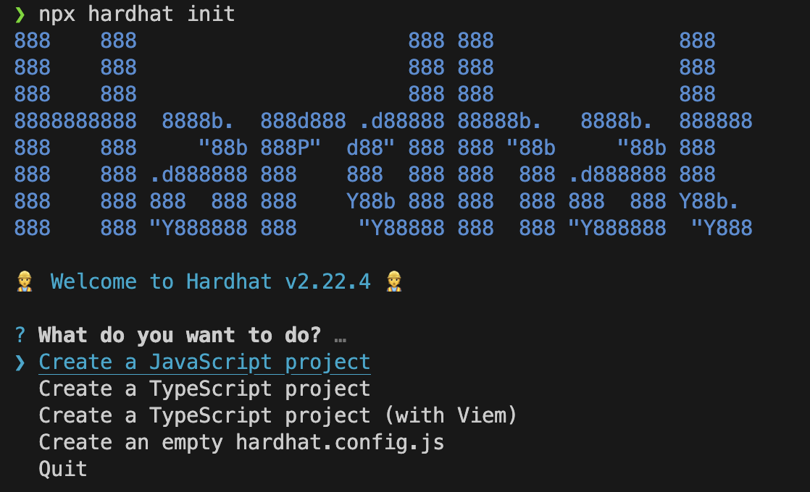

# 2. Hardhat으로 솔리디티 개발 환경 설정

## 도구 설치 및 로컬 개발 환경 구축

### 1) Node.js 및 NPM 설치
Node.js와 NPM(Node Package Manager)을 설치한다. 이는 솔리디티 개발 도구와 프레임워크를 설치하고 실행하는 데 필요하다.

- Node.js 다운로드: [Node.js 공식 사이트](https://nodejs.org/en)
- 설치 후 버전 확인

    ```bash
    node -v
    npm -v
    ```

### 2) 프로젝트 디렉토리 생성 및 Hardhat 설치
새 프로젝트 디렉토리를 생성하고, Hardhat을 설치한다.

Hardhat은 이더리움 기반의 스마트 컨트랙트 개발을 도와주는 개발 환경으로, 개발자가 스마트 컨트랙트 및 DApp 구축 과정 중 반복 작업을 관리하고 자동화하는데 도움을 준다.

Hardhat은 개발시 도움을 주는 로컬 Ethereum 네트워크인 Hardhat Network도 함께 포함하고 있어, 이를 통해 스마트 컨트랙트를 **배포하고 테스트하고 코드를 디버깅** 할 수 있다.

- 프로젝트 디렉토리 생성:

    ```bash
    mkdir MySolidityProject
    cd MySolidityProject
    ```
- Hardhat 설치:

    ```bash
    npm install --save-dev hardhat
    ```

### 3) Hardhat 초기화
- Hardhat 초기화:
    ```bash
    npx hardhat init
    ```
    초기화 명령을 실행하면 여러 옵션이 나타난다.

    </img>

    옵션을 모두 선택하면 아래와 같은 디렉토리 구조가 형성된다.

- Hardhat 초기 디렉토리 구조

    ```bash
    MySolidityProject
    ├── contracts               # 스마트 컨트랙트 파일을 포함하는 디렉토리
    │   └── Lock.sol            # 예시 컨트랙트
    ├── ignition                # 실행 가능한 스크립트 파일을 포함하는 디렉토리 (기존의 scripts)
    │   └── modules
    │       └── Lock.js         # 배포를 위한 코드
    ├── test                    # 테스트 파일을 포함하는 디렉토리
    │   └── Lock.js             # Lock.sol에 대한 테스트 코드
    ├── hardhat.config.js       # Hardhat 설정 파일
    ├── package.json
    ├── .gitignore
    └── node_modules/
    ``` 

### 4) Hardhat 설정 파일 수정
hardhat.config.js 파일에서 필요한 설정을 추가하거나 변경할 수 있다.

- Solidity 버전 설정
- 네트워크 (로컬, 테스트, 메인넷 등) 설정
- 컴파일러 설정
- 경로 (소스 코드, 테스트 파일, 캐시, 아티팩트 등) 설정
- 플러그인 설정

### 5) 스마트 계약 작성
초기화 단계에서 'Create an empty hardhat.config.js'를 제외한 다른 선택지로 진행했을 경우 'contracts' 디렉토리가 자동으로 생성되었을 것이다.

(아닌 경우 하위 경로에 'contracts' 디렉토리를 생성해준다.)

'contracts' 디렉토리에 스마트 계약 파일(.sol)을 작성한다.

- 'contracts' 디렉토리에 MyContract.sol 파일 생성:

    ```solidity
    // contracts/MyContract.sol
    pragma solidity ^0.8.0;

    contract MyContract {
        string public message;

        constructor(string memory initialMessage) {
            message = initialMessage;
        }

        function updateMessage(string memory newMessage) public {
            message = newMessage;
        }
    }
    ```

### 6) 스마트 계약 컴파일
- 컴파일 명령 실행:

    ```bash
    npx hardhat compile
    ```

    컴파일이 성공하면 터미널 창에 성공했다는 문구와 함께 'artifacts', 'cache' 폴더가 생성된다.

### 7) 로컬 이더리움 네트워크 시작
- 로컬 네트워크 시작:

    ```bash
    npx hardhat node
    ```
    로컬 네트워크를 시작하면 나의 로컬 환경에서만 작동하는 가상의 테스트 네트워크가 열리고 20개의 테스트 계정이 생성된다.

    > <span style="color:red">**[주의]**</span> Hardhat에서 기본적으로 제공하는 테스트 계정들 프라이빗 키가 공개되어 있기 때문에 메인넷 또는 다른 실제 네트워크에서 사용할 경우 자금이 손실될 수 있다.

### 8) 스마트 계약 배포 스크립트 작성 및 배포
'ignition/modules' 디렉토리에 배포 스크립트를 작성하고, 로컬 환경에 스마트 계약을 배포한다.

- 'ignition/modules' 디렉토리에 deploy.js 파일 생성:

    ```js
    // ignition/modules/deploy.js
    const { buildModule } = require("@nomicfoundation/hardhat-ignition/modules");

    module.exports = buildModule("MyModule", (m) => {
    const myContract = m.contract("MyContract", ["hello world!"]);

    return { myContract };
    });
    ```

- 배포 명령 실행:

    ```bash
    npx hardhat ignition deploy ignition/modules/deploy.js --network localhost
    ```

<br/>

> Hardhat의 대표 기능 중 하나인 테스트와 지정 네트워크에서의 배포는 [4. 테스트 및 배포]에서 다뤄보도록 하겠다.

<br/>
