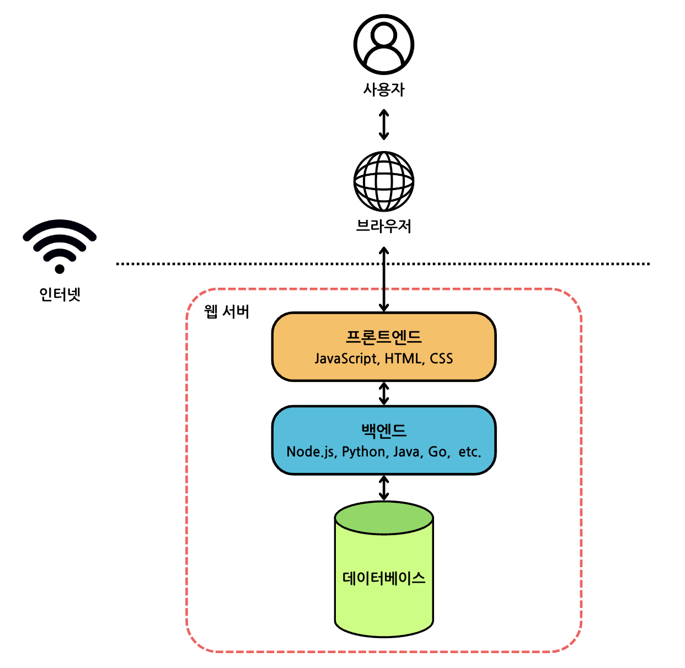
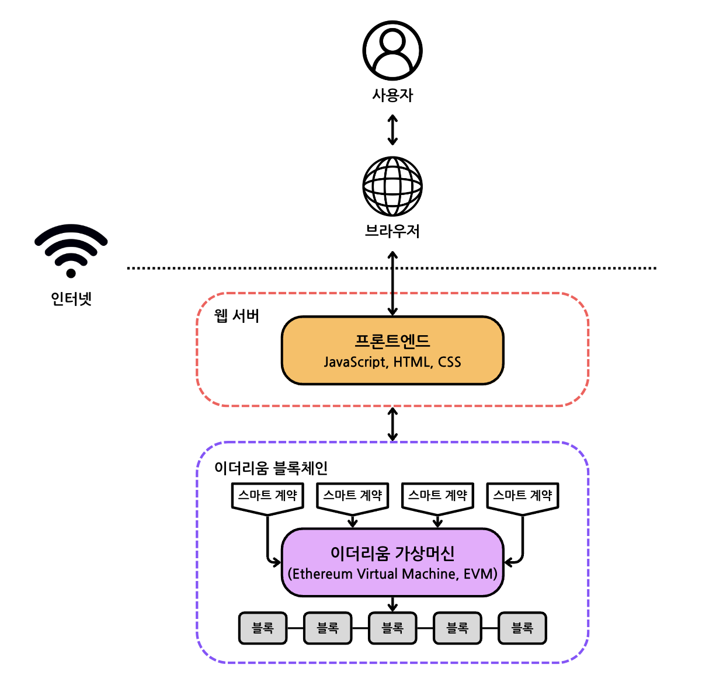
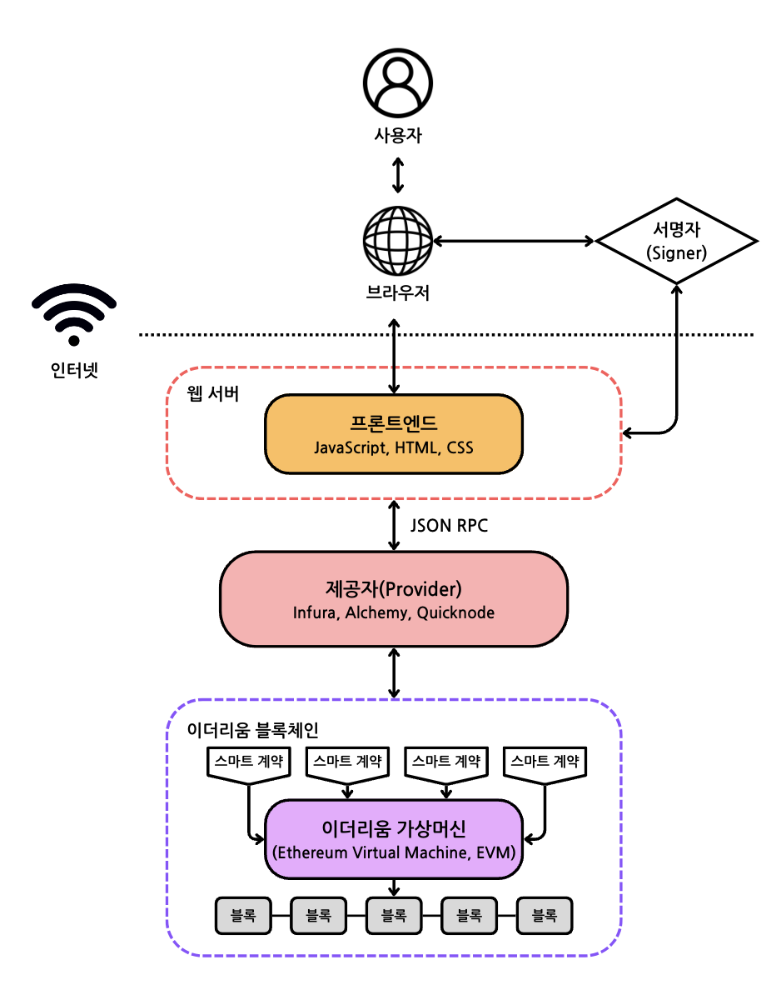

# 3. 웹3 디앱 아키텍처 및 Scaffold-ETH 사용법

## 웹3 디앱 아키텍처

### 1) 웹3와 웹2의 아키텍처 차이
웹3 애플리케이션의 웹2 애플리케이션은 전혀 다른 아키텍처를 가지고 있다.

웹2 애플리케이션의 예시로 간단한 블로그를 생각해보았을 때 필요한 것은 아래와 같다.
1. 사용자, 게시물, 태그, 댓글, 좋아요 등의 데이터를 저장할 수 있는 데이터베이스가 필요하다. 이는 끊임없이 업데이트되는 데이터베이스다.
2. 비즈니스 로직을 정의하는 백엔드 코드(예: Node.js, Java 또는 Python으로 작성됨)가 있어야 한다. 예를 들어, 새로운 사용자가 가입하거나, 새로운 블로그를 게시하거나, 다른 사람의 블로그에 댓글을 달 때 무슨 일이 발생하는지와 같은 로직을 정의해야 한다.
3. UI 로직을 정의하는 프론트엔드 코드(일반적으로 JavaScript, HTML, CSS로 작성됨)가 필요하다. 예를 들어, 사이트가 어떻게 생겼는지, 사용자가 페이지의 각 요소와 상호 작용할 때 무슨 일이 발생하는지를 정의해야 한다.

이 모든 것을 종합하면, 사용자가 블로그 게시물을 작성할 때 프론트엔드와 상호 작용하고, 프론트엔드는 백엔드와 상호 작용하며, 백엔드는 데이터베이스와 상호 작용한다. 이 모든 코드는 중앙 서버에 호스팅되며 인터넷 브라우저를 통해 사용자에게 전달된다. 이것이 오늘날 대부분의 Web 2.0 애플리케이션이 작동하는 방식이다.

</img>

하지만 웹3 애플리케이션에서는 이 모든 것이 바뀌었다.

### 웹3는 어떻게 다른가?
웹2 애플리케이션과 달리 웹3는 중개자가 없다. 애플리케이션 상태를 저장하는 중앙 집중식 데이터베이스도 없고, 백엔드 로직이 있는 중앙 집중식 웹 서버도 없다.

대신 블록체인을 활용하여 인터넷의 수많은 익명 노드(anonymous nodes)들이 유지 관리하는 분산 상태 기계(decentralized state machine)의 애플리케이션을 구축할 수 있다.

“상태 기계(state machine)”란 현재 상태와 허용되는 미래 상태를 유지 관리하는 기계를 의미한다. 상태 기계는 일련의 입력을 읽고 해당 입력에 따라 다른 상태로 변경된다.

</img>

블록체인은 어떤 초기 상태로 시작되고, 상태가 어떻게 전환될 수 있는지를 정의하는 매우 엄격한 규칙(즉, 합의)을 가진 상태 기계이다.

이 분산 상태 기계는 단일의 엔티티가 제어하는 것이 아니라, 네트워크의 모든 사람이 공동으로 유지 관리한다.

</img>

<br />

### [Web3.0과 Web2.0의 차이]
||Web3.0|Web2.0|
|:---:|:---:|:---:|
|서버와 통신|스마트 계약과 상호작용하기 위해 Web3.js, Ethers.js와 같은 라이브러리 사용|주로 RESTful API를 통해 서버와 통신, Axios, Fetch API 등을 사용|
|사용자 인증|사용자는 Metamask, WalletConnect와 같은 암호화폐 지갑을 통해 인증하고 트랜잭션을 서명|주로 OAuth, JWT토큰 등을 사용|
|상태 관리|블록체인 상태와 동기화, 블록체인 이벤트와 상태 변화를 실시간으로 감지 및 반영|Redux, MobX와 같은 라이브러리를 사용|
|데이터 저장|주요 데이터는 블록체인에 저장, 오프체인 데이터는 IPFS, Swarm 등을 사용|데이터베이스(MySQL, MongoDB 등) 사용|
|비즈니스 로직 처리|스마트 계약(솔리디티 코드) 내에서 비즈니스 로직을 처리, 블록체인 상에 배포되고 실행됨|서버 측에서 비즈니스 로직을 처리|
|서버 관리|탈중앙화된 네트워크에서 실행되기 때문에 중앙 서버 관리가 필요 없음|중앙 서버를 관리하고 유지보수 함|
|보안|코드에 취약점이 있을 경우 큰 금전적 손실이 발생할 수 있기 때문에 스마트 계약 배포 전 철저한 코드 리뷰와 보안 감사가 필요함|데이터베이스와 서버의 보안이 중요|


### 2) 프론트엔드와 스마트 계약의 상호작용 방법
1. 상태 읽기

    프론트엔드가 스마트 계약의 데이터와 함수를 호출할 수 있도록 하려면 제공자(provider)가 필요하다.

    > 제공자(provider): 연결 노드를 제공하는 서드파티(ex. Infura, Alchemy, Quicknode 등)로, 서드파티 서비스를 사용하면 전체 노드를 직접 운영하지 않아도 되며, 확장되고 복잡해진 인프라서를 유지 관리하는데 도움을 준다.

2. 상태 쓰기

    제공자를 통해 블록체인에 연결되면, 블록체인에 저장된 상태를 읽을 수 있다. 그러나 상태를 쓰고 싶다면, 거래를 블록체인에 제출하기 전에 한 가지 더 해야 할 일이 있다. 바로 개인 키를 사용하여 거래를 "서명"하는 것이다.

    >읽는 것 (서명 필요 X) / 쓰는 것 (서명 필요 O)

    사용자가 블록체인에 새로운 데이터를 쓰고자 할 때, DApp은 사용자가 개인 키를 사용하여 거래를 "서명"하도록 요청할 것이다. 서명이 이루어지고나면 노드가 거래를 수락하고 거래가 블록체인에 전달되게 된다.

    이 거래 "서명" 과정에서 주로 사용하는 것이 Metamask이다.

    > Metamask는 애플리케이션이 키 관리와 거래 서명을 쉽게 처리할 수 있도록 하는 도구로, Metamask는 사용자의 개인 키를 브라우저에 저장하며, 프론트엔드에서 사용자가 거래를 서명해야 할 때 Metamask를 호출한다.

    <br />

    </img>


### 3) React에서 스마트 계약 상호작용 예시
- React 프로젝트 생성
    ```bash
    npx create-react-app project
    cd myproject
    ```

- Ethers 설치
    ```bash
    npm install ethers
    ```

- js에서 import
    ```javascript
    // Import everything
    import { ethers } from "ethers";

    // Import just a few select items
    import { BrowserProvider, parseUnits } from "ethers";

    // Import from a specific export
    import { HDNodeWallet } from "ethers/wallet";
    ```

- Metamask를 이용해 다음과 같은 기능을 제공하는 객체를 window에 주입
    - 이더리움 네트워크에 대한 읽기 전용 엑세스 (제공자)
    - 개인 키를 지원하는 인증된 쓰기 엑세스 (서명자)
    ```javascript
    // App.js

    import { ethers } from "ethers";

    const App = () => {
    let signer = null;
    let provider;

    const connectMetamask = async () => {
        if (window.ethereum == null) {
            // Metamask 미설치인 경우, 디폴트 제공자를 사용 (읽기 전용)
            console.log("MetaMask not installed; using read-only defaults")
            provider = ethers.getDefaultProvider()
        } else {
            // MetaMask EIP-1193 객체와 연결
            provider = new ethers.BrowserProvider(window.ethereum)
            signer = await provider.getSigner();
        }
    }

    return (
        <>
        <button onClick={connectMetamask}>Metamask 연결</button>
        </>
    )
    }

    export default App;
    ```

- 커스텀 제공자 연결시 JSON RPC 설정 (참고: [Infura endpoints](https://docs.infura.io/api/network-endpoints))
    ```javascript
    // const url = 'http://my-node.com';
    provider = new ethers.JsonRpcProvider(url)
    ```

- 제공자로 데이터 읽기
    ```javascript
    // 현재 블록 넘버 (i.e. height)
    const blockNum = await provider.getBlockNumber();
    // 20016239

    // 현재 계정 잔액 (매개변수로 지갑 주소 입력)
    const balance = await provider.getBalance("my address");
    // 4085267032476673080n

    // 단위 변경 (wei -> ether)
    formatEther(balance)
    // '4.08526703247667308'
    ```

- 트랜잭션 보내기
    ```javascript
    // 트랜잭션을 보낼 때 단위 변경 (ether -> wei)
    const tx = await signer.sendTransaction({
    to: "other address",
    value: parseEther("1.0") // 1.0 ether == 1.0 * 10^18 wei
    });
    ```

- 스마트 계약 연결하기
    스마트 계약 컴파일시 생성된 ABI (Application Binary Interface)와 배포시 생성된 주소(CA, Contract Address)가 필요하다.
    ```javascript
    // artifacts/contracts/Mycontract.sol/MyContract.json 에서 찾을 수 있음
    const abi = [{
      "inputs": [
        {
          "internalType": "string",
          "name": "initialMessage",
          "type": "string"
        }
      ],
      "stateMutability": "nonpayable",
      "type": "constructor"
    },
    {
      "inputs": [],
      "name": "message",
      "outputs": [
        {
          "internalType": "string",
          "name": "",
          "type": "string"
        }
      ],
      "stateMutability": "view",
      "type": "function"
    },
    {
      "inputs": [
        {
          "internalType": "string",
          "name": "newMessage",
          "type": "string"
        }
      ],
      "name": "updateMessage",
      "outputs": [],
      "stateMutability": "nonpayable",
      "type": "function"
    }]

    // 컨트랙트 생성시 매개변수로 스마트 계약 주소, abi, 제공자 입력
    const contract = new Contract("my contract address", abi, provider)
    ```

<br />

## Scaffold-ETH 설치 및 사용 방법