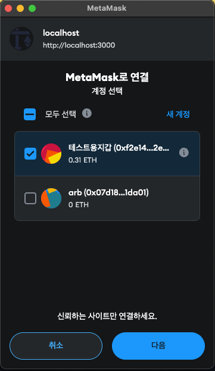
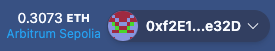
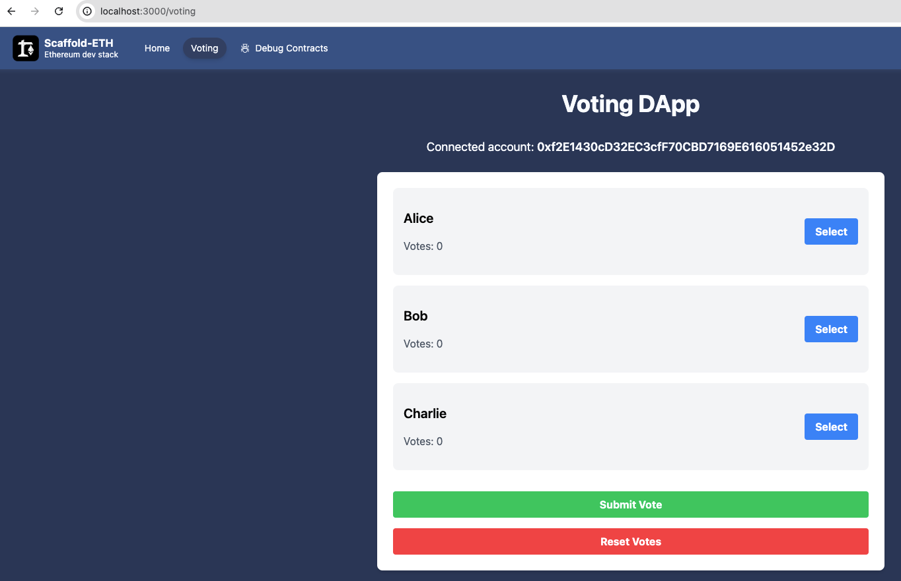
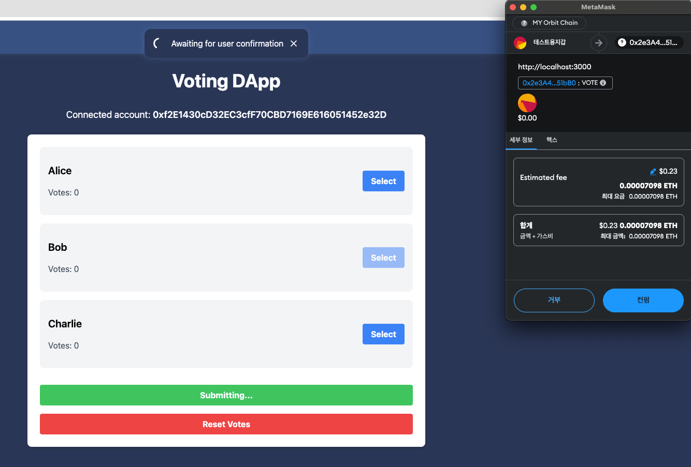
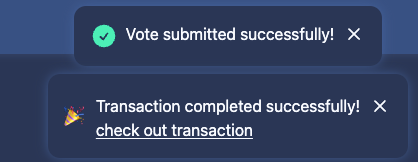

# Arbitrum DApp
- 투표를 할 수 있는 DApp이며, 한 번만 투표할 수 있으며, Reset이 가능하다.

## 목표
- Scaffold-Eth를 사용해 Arbitrum Sepolia 네트워크에 스마트 컨트랙트를 배포하고 쉽게 DApp을 구현한다.

## Scaffold-Eth
- Scaffold-ETH는 Ethereum 개발을 위한 완전한 툴킷이다. 
- dApp을 신속하게 구축하고 배포할 수 있도록 돕는 다양한 도구와 템플릿을 제공한다.
- git clone을 통하여 프로젝트를 쉽게 시작할 수 있다.
```shell
git clone https://github.com/scaffold-eth/scaffold-eth-2.git
```

### 의존성 설치
- 모노 레포로써 최상위 package.json에 workspaces 설정이 되어있어 최상위에서 한번만 install 하면 된다. 
- (packages/hardhat, packages/nextjs 둘다 설치 된다.)

### 설정
- 기본적으로 로컬 네트워크로 돌아가므로, Arbitrum Sepolia Network에 배포하고 사용하기 위해 설정을 해주어야 한다.

<br/>

1. Scaffold-eth2 타겟 네트워크를 변경한다. <br/>
packages/nextjs/scaffold.config.ts

```typescript
targetNetworks: [chains.arbitrumSepolia]
```

<br/>
 
2. 기본 배포 네트워크도 arbitrumSepolia로 바꿔 준다. <br/>
packages/hardhat/hardhat.config.ts

```typescript
  defaultNetwork: "arbitrumSepolia",
```

<br/>

3. packages/hardhat/.env.example 파일을 참고하여환경 변수 적용을 해준다. <br/>
packages/hardhat/.env

```tsx
ALCHEMY_API_KEY=key
DEPLOYER_PRIVATE_KEY=key
ETHERSCAN_API_KEY=key
```

<br/>

etherscan api key는 아래 docs를 참고하여 다운 받자.

https://docs.etherscan.io/getting-started/viewing-api-usage-statistics

<br/>

### 스마트 컨트랙트 작성

packages/hardhat/contracts/YourContract.sol을 파일명 변경 후,

packages/hardhat/contracts/Voting.sol 컨트랙트 작성 하자.

```solidity
// SPDX-License-Identifier: MIT
pragma solidity ^0.8.0;

contract Voting {
    struct Candidate {
        string name;
        uint voteCount;
    }

    address public owner;
    mapping(address => bool) public voters;
    Candidate[] public candidates;
    address[] public voterList;

    constructor(string[] memory candidateNames) {
        owner = msg.sender; // 배포자를 owner로 설정
        for (uint i = 0; i < candidateNames.length; i++) {
            candidates.push(Candidate({
                name: candidateNames[i],
                voteCount: 0
            }));
        }
    }

    function vote(uint candidateIndex) public {
        require(!voters[msg.sender], "Already voted.");
        require(candidateIndex < candidates.length, "Invalid candidate.");

        voters[msg.sender] = true;
        voterList.push(msg.sender); // 투표한 주소를 목록에 추가
        candidates[candidateIndex].voteCount++;
    }

    function getCandidates() public view returns (Candidate[] memory) {
        return candidates;
    }

    function resetVotes() public {
        require(msg.sender == owner, "Only owner can reset votes.");
        for (uint i = 0; i < candidates.length; i++) {
            candidates[i].voteCount = 0;
        }
        for (uint i = 0; i < voterList.length; i++) {
            voters[voterList[i]] = false;
        }
        delete voterList; // 투표자 목록 초기화
    }
}
```

<br/>

### deploy 코드 구현

packages/hardhat/deploy/00_deploy_voting 작성 (00_deploy_your_contract.ts파일명 및 내용을 바꾼다.)

```tsx
import { HardhatRuntimeEnvironment } from "hardhat/types";
import { DeployFunction } from "hardhat-deploy/types";

const func: DeployFunction = async ({ getNamedAccounts, deployments }: HardhatRuntimeEnvironment) => {
  const { deploy } = deployments;
  const { deployer } = await getNamedAccounts();

  const candidates = ["Alice", "Bob", "Charlie"];

  await deploy("Voting", {
    from: deployer,
    args: [candidates],
    log: true,
  });
};

export default func;
func.tags = ["Voting"];
```

<br/>

### 프론트엔드 (Next.js) 페이지 구현
nextjs/app/voting/page.tsx
```tsx
'use client';

import React, { useState, useEffect } from 'react';
import { useAccount, useConnect } from 'wagmi';
import { useDeployedContractInfo, useScaffoldReadContract, useScaffoldWriteContract } from '~~/hooks/scaffold-eth';
import { notification } from '~~/utils/scaffold-eth';

const VotePage = () => {
    const { address, isDisconnected } = useAccount();
    const { connect, connectors } = useConnect();
    const [selectedCandidate, setSelectedCandidate] = useState<number | null>(null);
    const [hasVoted, setHasVoted] = useState(false);
    const [isOwner, setIsOwner] = useState(false);

    // 계약 정보 가져오기
    const { data: votingContractInfo, isLoading: isLoadingContractInfo } = useDeployedContractInfo('Voting');
    const votingContractAddress = votingContractInfo?.address;
    const votingContractAbi = votingContractInfo?.abi;

    useEffect(() => {
        console.log("Voting Contract Info:", votingContractInfo);
    }, [votingContractInfo]);

    // 후보자 리스트 가져오기
    const { data: candidates, isLoading: isLoadingCandidates, refetch: refetchCandidates } = useScaffoldReadContract({
        contractName: 'Voting',
        functionName: 'getCandidates',
    });

    // 사용자 투표 상태 가져오기
    const { data: voterStatus, isLoading: isLoadingVoterStatus, refetch: refetchVoterStatus } = useScaffoldReadContract({
        contractName: 'Voting',
        functionName: 'voters',
        args: [address],
    });

    // 배포자 주소 가져오기
    const { data: ownerAddress, isLoading: isLoadingOwnerAddress } = useScaffoldReadContract({
        contractName: 'Voting',
        functionName: 'owner',
    });

    useEffect(() => {
        if (voterStatus !== undefined) {
            setHasVoted(voterStatus);
        }
        if (ownerAddress !== undefined) {
            setIsOwner(address === ownerAddress);
        }
    }, [voterStatus, ownerAddress, address]);

    const { writeContractAsync: vote, isMining, error: txError } = useScaffoldWriteContract('Voting');
    const { writeContractAsync: resetVotes, isMining: isResetting, error: resetError } = useScaffoldWriteContract('Voting');

    const handleVote = async () => {
        if (vote && selectedCandidate !== null) {
            try {
                await vote({
                    abi: votingContractAbi,
                    address: votingContractAddress,
                    functionName: 'vote',
                    args: [selectedCandidate],
                });
                notification.success('Vote submitted successfully!');
                await refetchVoterStatus();
                await refetchCandidates();
                setHasVoted(true);
            } catch (error) {
                console.error('Error while voting:', error);
                notification.error('Error while submitting vote.');
            }
        } else {
            console.error('vote function is not available or candidate not selected');
        }
    };

    const handleReset = async () => {
        if (resetVotes) {
            try {
                await resetVotes({
                    abi: votingContractAbi,
                    address: votingContractAddress,
                    functionName: 'resetVotes',
                });
                notification.success('Votes reset successfully!');
                await refetchVoterStatus();
                await refetchCandidates();
            } catch (error) {
                console.error('Error while resetting votes:', error);
                notification.error('Error while resetting votes.');
            }
        } else {
            console.error('resetVotes function is not available');
        }
    };

    if (isLoadingContractInfo || isLoadingCandidates || isLoadingVoterStatus || isLoadingOwnerAddress) {
        return <div className="flex items-center justify-center h-screen"><div className="text-2xl">Loading...</div></div>;
    }

    return (
        <div className="p-8">
            <h1 className="text-4xl font-bold mb-8 text-center">Voting DApp</h1>
            {isDisconnected ? (
                <div className="text-center">
                    <p className="text-lg mb-4">Please connect to MetaMask</p>
                    <button
                        className="bg-blue-500 hover:bg-blue-700 text-white font-bold py-2 px-4 rounded"
                        onClick={() => connect({ connector: connectors.find(c => c.id === 'injected') })}
                    >
                        Connect MetaMask
                    </button>
                </div>
            ) : (
                <div>
                    <p className="text-lg mb-6 text-center">Connected account: <span className="font-semibold">{address}</span></p>
                    <div className="max-w-3xl mx-auto bg-white p-6 rounded-lg shadow-md">
                        <ul>
                            {candidates && candidates.map((candidate, index) => (
                                <li key={index} className="bg-gray-100 p-4 rounded-lg mb-4 flex justify-between items-center">
                                    <div>
                                        <p className="text-xl font-semibold text-black">{candidate.name}</p>
                                        <p className="text-gray-600">Votes: {candidate.voteCount.toString()}</p>
                                    </div>
                                    {!hasVoted && (
                                        <button
                                            className={`ml-4 bg-blue-500 hover:bg-blue-700 text-white font-bold py-2 px-4 rounded ${selectedCandidate === index ? 'opacity-50 cursor-not-allowed' : ''}`}
                                            onClick={() => setSelectedCandidate(index)}
                                            disabled={selectedCandidate === index}
                                        >
                                            Select
                                        </button>
                                    )}
                                </li>
                            ))}
                        </ul>
                        {!hasVoted ? (
                            <button
                                className="w-full bg-green-500 hover:bg-green-700 text-white font-bold py-2 px-4 rounded mt-4"
                                onClick={handleVote}
                                disabled={selectedCandidate === null || isMining}
                            >
                                {isMining ? 'Submitting...' : 'Submit Vote'}
                            </button>
                        ) : (
                            <p className="text-center text-green-600 font-bold mt-4">You have already voted.</p>
                        )}
                        {txError && <p className="text-red-600 text-center mt-4">Transaction Error: {txError.message}</p>}
                        {isOwner && (
                            <button
                                className="w-full bg-red-500 hover:bg-red-700 text-white font-bold py-2 px-4 rounded mt-4"
                                onClick={handleReset}
                                disabled={isResetting}
                            >
                                {isResetting ? 'Resetting...' : 'Reset Votes'}
                            </button>
                        )}
                        {resetError && <p className="text-red-600 text-center mt-4">Reset Error: {resetError.message}</p>}
                    </div>
                </div>
            )}
        </div>
    );
};

export default VotePage;
```

<br/>

방금 만든 페이지로 이동하기 위한 헤더 버튼을 만들어주자. <br/>
next/js/components/Header.tsx에 버튼을달아준다.

```tsx
export const menuLinks: HeaderMenuLink[] = [
  {
    label: "Home",
    href: "/",
  },
  {
    label: "Voting",
    href: "/voting"
  },
  {
    label: "Debug Contracts",
    href: "/debug",
    icon: <BugAntIcon className="h-4 w-4" />,
  },
];
```

<br/>

### 컨트랙트 배포
기본적인 설정이 arbitrum sepolia로 되어 있기 때문에 yarn deploy로 바로 배포 가능하다.

```shell
yarn deploy

deploying "Voting" (tx: 0xee038f370b40d09058a2c730172fba93cb79364513d093a0a778f26e14714c99)...: deployed at 0x5e27F6BFe1e5031893305ea2d1F1E4C7fbecf247 with 1217081 gas
📝 Updated TypeScript contract definition file on ../nextjs/contracts/deployedContracts.ts
```

<br/>

### 실행
```shell
yarn start
```

<br/>

http://localhost:3000/ 에 접속하여 지갑을 연결해주자.





<br/>
연결이 되면 아래와 같이 정보가 나온다.



<br/>

Voting 버튼을 클릭해 이동한다.



<br/>

Select 버튼을 눌러 후보자를 선택하고 Submit Vote를 클릭하면 컨펌 창이 뜨게 된다. 컨펌을 눌러보자.



<br/>

아래와 같이 성공 메시지가 뜨고, check out transaction 버튼을 클릭해 보면,



<br/>

해당 트랜잭션을 확인할 수 있다.

