# L1 -> L2 메시지 예제

## L1 -> L2 이해하기

### Layer1(L1) 란?

Layer 1은 이더리움, 비트코인 등 주요 블록체인 네트워크로, 기본적인 거래와 스마트 계약을 처리한다. 높은 수준의 보안과 탈중앙화를 제공하지만, 거래 속도가 느리고 비용이 높다. 모든 Layer 2 솔루션은 Layer 1의 인프라를 기반으로 구축되어 운영된다.

### Layer2(L2) 란?

Layer 2는 Layer 1의 확장성 문제를 해결하기 위해 개발된 프로토콜로, 더 빠르고 저렴한 거래를 가능하게 한다. Layer 2는 주로 Layer 1의 보안을 상속받으면서도 독립적으로 운영되는 보조 네트워크이다. 많은 거래를 오프체인에서 처리하여 Layer 1의 부하를 줄이고, 주기적으로 Layer 1에 요약된 결과를 기록한다.

### L1 이더리움 (sepolia testnet) -> L2 아비트럼 (sepolia testnet)

블록체인 L1 에서 L2 로 메시징한다는 것은 이더리움에서 아비트럼으로 메시징을 한다고 이해하면 좋다. 아비트럼은 이더리움의 확장성을 제공하는 레이어2로 다음 예제는 이더리움의 세폴리아 테스트넷(L1) -> 아비트럼 세폴리아 테스트넷(L2) 의 구조로 띈다.

## Greeter Tutorial

- 아비트럼 공식 튜토리얼 : https://github.com/OffchainLabs/arbitrum-tutorials/tree/master/packages/greeter
- L1 -> L2 예제 : https://github.com/sashaaldrick/greeter-arb?tab=readme-ov-file
- 아비트럼 공식 예제를 바탕으로 위의 L1 -> L2 예제를 진행

### Clone repository

- 비주얼 스튜디오 코드를 열고 최상단의 Terminal 클릭
- 아래 코드를 복사하여 자신의 폴더에 레포지토리 클론
- 클론 후 클론된 greeter-arb 폴더로 이동

```
git clone https://github.com/sashaaldrick/greeter-arb.git // 자신의 폴더에 위 주소의 레포지토리를 클론.
cd greeter-arb // 클론된 폴더로 이동.
```

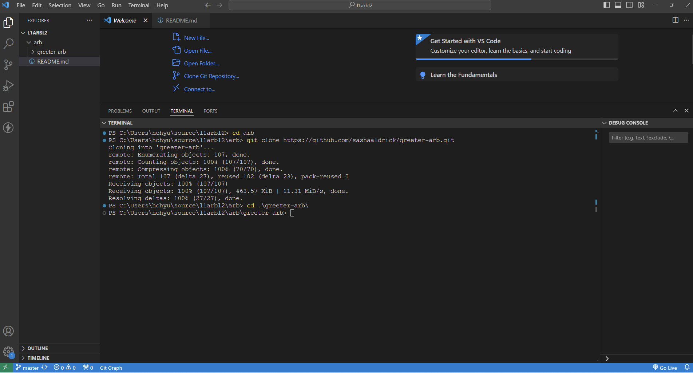

- greeter-arb 폴더에 .env파일을 만들고, .env.sample 폴더에 있는 내용을 복사한 후 .env.sample 삭제

  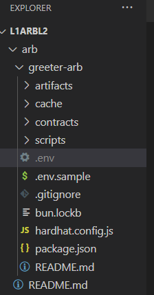

## 폴더의 구조

```
- arb
    - greeter-arb
        -artifacts
        - cache
        - contracts
            - arbitrum
                - GreeterL2.sol
            - ethereum
                - GreeterL1.sol
            - Geeter.sol
        - scripts
            - arb-shared-dependencies
            - exec.js
        - .env
        - hardhat.config.js
        - package.json
```

## 따라하기

### 1. 폴더 생성

#### arb 폴더 생성

```
cd arb // arb 폴더를 만들고 해당하는 폴더로 이동
```

### 2. 하위 폴더 및 종속성 설치

- arb 폴더의 하위 폴더와 config.js 과 package.json 을 설정합니다.

```
npm install // 혹은 npm i
```

- npm install 을 통해 package.json 종속성 받기

### 3. 테스트넷 이더리움 받기

- 개발을 진행할때 스마트 컨트랙트를 배포하면 컨트랙트의 opcode에 의해 가스비가 지출된다.
- L1 과 L2 의 GreeterL1.sol 과 GreeterL2.sol을 배포하기 위해선 양쪽 이더리움 세폴리아 테스트넷의 이더리움와 아비트럼 세폴리아 테스트넷의 이더리움이 가스비로 사용된다.이를 위해 아래 faucet에서 이더리움을 받아야한다.
- 이더리움 세폴리아 faucet : https://www.alchemy.com/faucets/ethereum-sepolia

- 아비트럼 세폴리아 faucet : https://www.alchemy.com/faucets/arbitrum-sepolia
  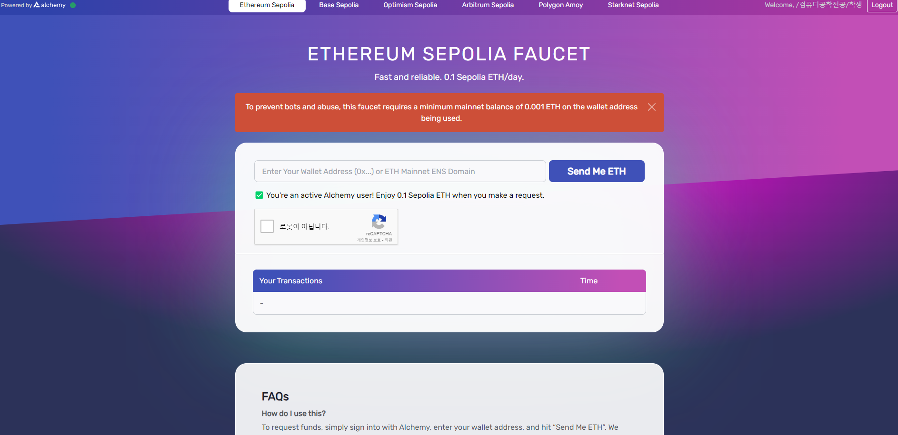

- 자신의 지갑 주소를 복사하고 이더리움 세폴리아와 아비트럼 세폴리아에서 각각 테스트넷 이더를 받는다.
  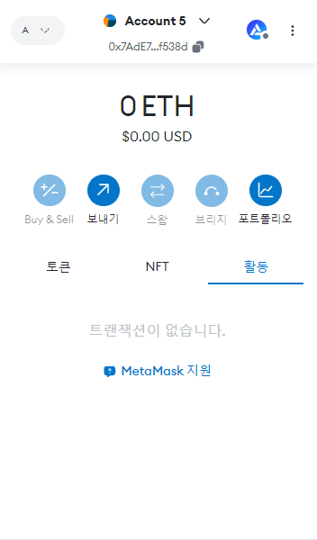

- 최근 테스트넷 봇이나 남용되는 것을 막기위해 테스트넷 이더를 받으려면 자신의 실제 이더리움이 메인넷에 0.001 ETH개 있어야 한다.

### 4. .env 파일 설정

- 추가적으로 .env 의 key 및 rpc 프로바이더를 이용하기 위해 dotenv 패키지 설치.

```
npm i dotenv
```

- exec.js 파일의 16번째 const { BigNumber } = require("@ethersproject/bignumber");
- 아랫줄에 require("dotenv").config(); 코드를 추가.

  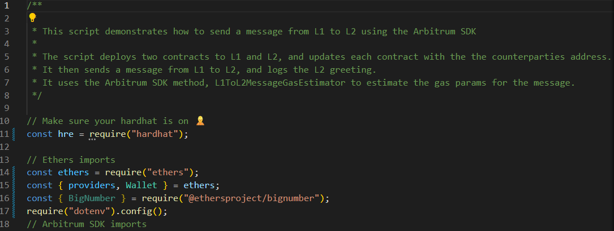

##### .env 파일 내부 요소

- DEVNET_PRIVKEY
- L2RPC
- L1RPC

```
# 자신의 개발용 프라이빗 키 "0x...." 형식으로 입력
DEVNET_PRIVKEY=""

# Layer2 RPC 어그리게이터 노드 주소 입력
L2RPC=""

# Layer1 RPC 어그리게이터 노드 주소 입력
L1RPC=""

```

### 5. RPC 설정

#### 블록체인 RPC란?

블록체인 RPC는 원격 프로시저 호출을 통해 블록체인 노드와 상호작용할 수 있게 한다. 이를 통해 스마트 계약을 배포하거나 거래 내역을 조회하는 등의 작업을 쉽게 수행할 수 있다. 개발자는 RPC를 사용하여 블록체인 네트워크의 데이터를 프로그램적으로 읽고 쓸 수 있다.

- RPC의 경우 https://www.alchemy.com/ 에서 설정.

- alchemy 주소에 들어가서 Create a new app 을 한다.

  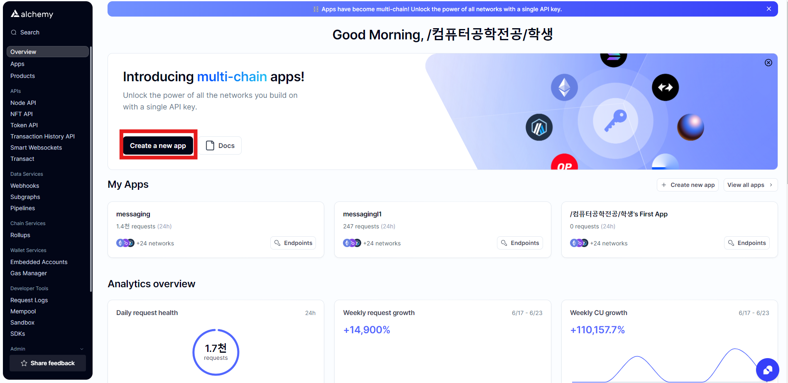

- 자신이 사용할 app 이름을 설정.

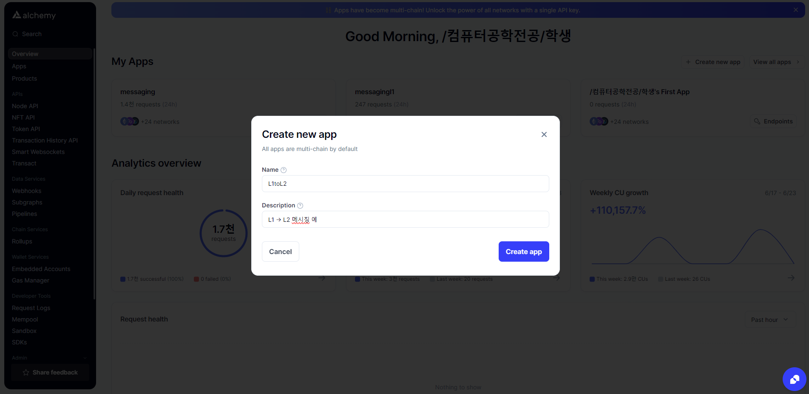

- app을 만들게 되면 overview에 자신의 app이 뜨는데, overview 옆에 Network를 누르고, Ethereum api, Arbitrum api를 복사해서 자신의 L1rpc, L2rpc 에 입력한다.

```
# 자신의 개발용 프라이빗 키 "0x...." 형식으로 입력
DEVNET_PRIVKEY=""

# Layer2 RPC 어그리게이터 노드 주소 입력
L2RPC="알케미에서 아비트럼 rpc 복사해서 입력"

# Layer1 RPC 어그리게이터 노드 주소 입력
L1RPC="알케미에서 이더리움 rpc 복사해서 입력"

```

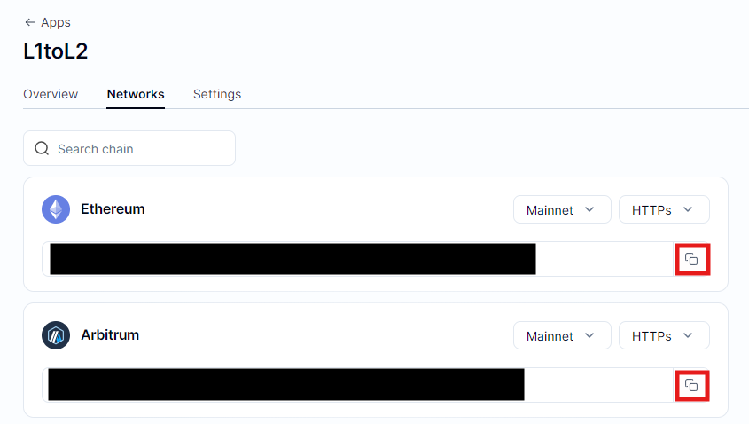

### 6. DEVNET_PRIVKEY 설정

- metamask의 우측 상단의 점 표시를 클릭.

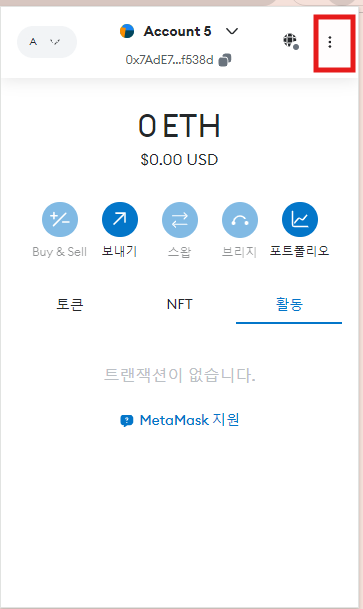

- 계정 세부 정보 클릭.


- 개인키 표시 클릭 및 개인키 복사 0x...형태

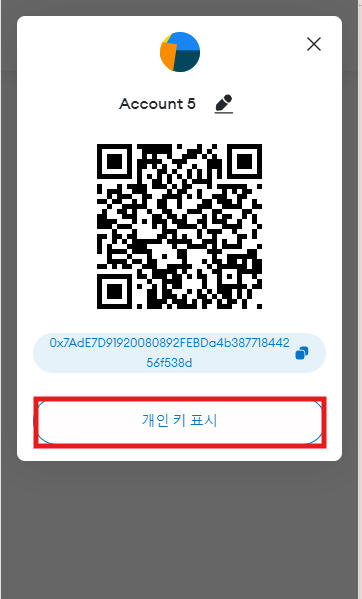

```
# 자신의 개발용 프라이빗 키 "0x..." 형식으로 입력
DEVNET_PRIVKEY="메타마스크에서 뽑은 자신의 개인키 입력"

# Layer2 RPC 어그리게이터 노드 주소 입력
L2RPC="알케미에서 아비트럼 rpc 복사해서 입력"

# Layer1 RPC 어그리게이터 노드 주소 입력
L1RPC="알케미에서 이더리움 rpc 복사해서 입력"

```

#### 주의사항

- DAPP 개발 시 안전한 보안을 위해 꼭 개발용 메타마스크를 만드실 것을 요구한다.

- 자신의 지갑과 물리적으로 분리하여 개발용 컴퓨터를 사용하는 것도 좋다.

- 실제로 프라이빗 키 유출사례는 굉장히 많기 때문에 개발 시 각별히 주의.

### 7. 실행

- npm run greeter 명령어를 치면 A, 아비트럼 심볼이 나오면서 코드가 실행된다.

```
npm run greeter
```

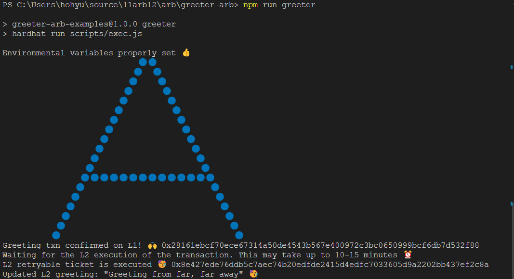

- 위와 같은 그림이 나오면 정상적으로 L1 -> L2 메시징 동작

### 8. 생각해보기

- 위와 같은 예제를 통해 머리에서 추상적으로 네트워크간의 이동과 L1과 L2의 역할이 무엇인지 이해해보자. 그림판을 키고 그 위에서 자신이 생각하는 이동로직과 상상을 하는 것이 좋다.
- example

  - ex) 사용자가 이더리움 네트워크의 이더리움을 아비트럼 네트워크로 이동시킬때
  - ex) 사용자가 특정한 거래를 실행하고, 이를 L1 -> L2로 전송하여 L2에서 이를 처리하고 결과를 L2 -> L1 하는 방식

- 실제 DEFI, NFT, GAMEFI 등등 여러 생태계를 사용해 보면서 실제로 내가 했던 클릭 혹은 터치, 상호작용이 어떤 컨트랙트를 발생시키고 블록체인 네트워크에서 어떤식으로 동작하는지 생각하기.

### 9. 결론

- 여러 도구를 사용해보고, 기본적인 셋팅법을 익힌다.
- 이 프로젝트를 통해 레이어1 과 레이어2의 이해와 메시지를 날리는 구조를 이해한다.
