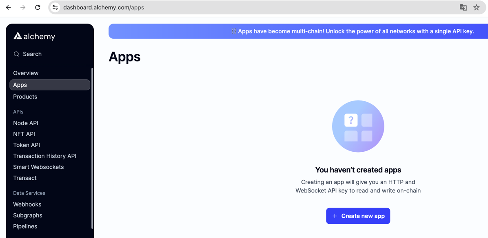
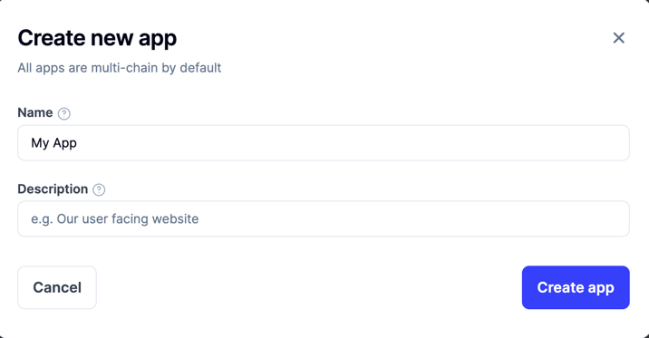
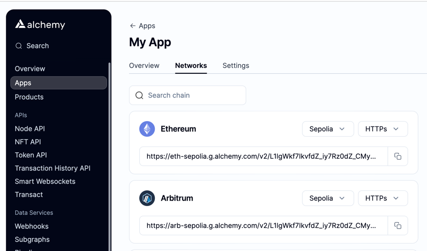
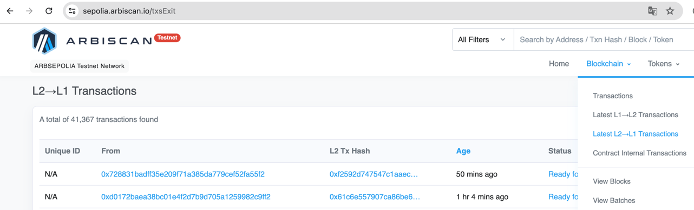
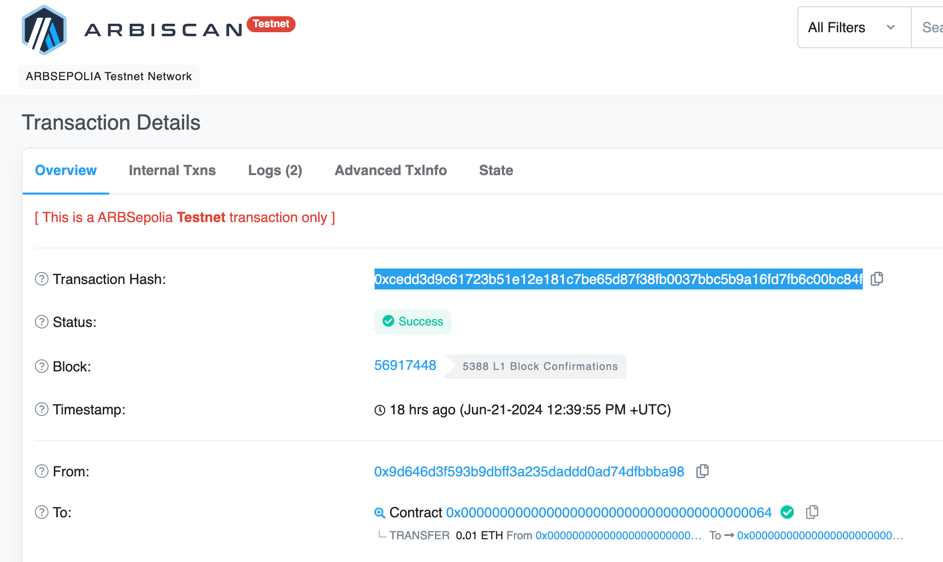
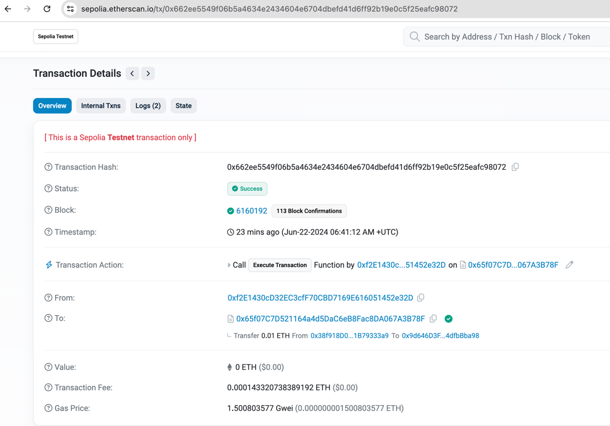

아비트럼 공식 튜토리얼: https://github.com/OffchainLabs/arbitrum-tutorials/tree/master/packages/outbox-execute

# 프로젝트 구조
. <br/>
├── hardhat.config.js <br/>
├── node_modules <br/>
├── package-lock.json <br/>
├── package.json <br/> 
└── scripts <br/>
&nbsp;&nbsp;&nbsp;&nbsp;&nbsp;&nbsp;&nbsp;&nbsp;&nbsp;&nbsp;&nbsp;└── exec.js <br/>


# 프로젝트 셋팅
새 프로젝트를 생성 후, node 프로젝트를 초기화 한다.

```shell
npm init -y
```

<br/>

package.json을 수정한다.
```json
{
  "name": "outbox-execute",
  "license": "Apache-2.0",
  "version": "1.0.0",
  "scripts": {
    "build": "hardhat compile",
    "outbox-exec": "hardhat outbox-exec"
  },
  "devDependencies": {
    "@nomiclabs/hardhat-ethers": "^2.0.2",
    "chai": "^4.3.4",
    "ethers": "^5.1.2",
    "hardhat": "^2.9.1"
  },
  "dependencies": {
    "@arbitrum/sdk": "^v3.1.9",
    "arb-shared-dependencies": "^1.0.0",
    "dotenv": "^8.2.0"
  }
}
```

<br/>

패키지들을 설치한다.
```shell
npm install
```

# 코드 구현

/scripts/exec.js 파일을 생성 후 구현한다.
```js
const { providers, Wallet } = require('ethers')
const {
  addDefaultLocalNetwork,
  L2TransactionReceipt,
  L2ToL1MessageStatus,
} = require('@arbitrum/sdk')
const { arbLog, requireEnvVariables } = require('arb-shared-dependencies')
require('dotenv').config()
requireEnvVariables(['DEVNET_PRIVKEY', 'L2RPC', 'L1RPC'])

/**
 * 설정: 공급자에 연결된 L1 지갑 인스턴스화
 */

const walletPrivateKey = process.env.DEVNET_PRIVKEY

const l1Provider = new providers.JsonRpcProvider(process.env.L1RPC)
const l2Provider = new providers.JsonRpcProvider(process.env.L2RPC)
const l1Wallet = new Wallet(walletPrivateKey, l1Provider)

module.exports = async txnHash => {
  await arbLog('Outbox Execution')

  /**
   * SDK에 기본 로컬 네트워크 구성 추가
   * 이 스크립트를 로컬 노드에서 실행하려면
   */
  addDefaultLocalNetwork()

  /**
   * txn 해시로 시작합니다. 우리는 이것이 L2에서 L2-L1 메시지(예: ArbSys.sendTxToL1)를 트리거한 트랜잭션이라고 가정합니다.
   */
  if (!txnHash)
    throw new Error(
        'L2에서 L1 메시지로 보내는 L2 트랜잭션의 트랜잭션 해시 제공'
    )
  if (!txnHash.startsWith('0x') || txnHash.trim().length != 66)
    throw new Error(`음, ${txnHash} txn 해시처럼 보이지 않습니다 ...`)

  /**
   * 먼저, 제공된 txn 해시에서 Arbitrum txn을 찾아보겠습니다.
   */
  const receipt = await l2Provider.getTransactionReceipt(txnHash)
  const l2Receipt = new L2TransactionReceipt(receipt)

  /**
   * 원칙적으로 단일 트랜잭션으로 인해 나가는 메시지가 얼마든지 트리거될 수 있습니다. 일반적인 경우는 하나만 있을 것입니다.
   * 이 스크립트를 위해 우리는 하나만 있다고 가정합니다. 첫 번째 스크립트만 졸업하면 됩니다.
   */
  const messages = await l2Receipt.getL2ToL1Messages(l1Wallet)
  const l2ToL1Msg = messages[0]

  /**
   * 이미 실행되었는지 확인
   */
  if ((await l2ToL1Msg.status(l2Provider)) == L2ToL1MessageStatus.EXECUTED) {
    console.log(`메시지가 이미 실행되었습니다! 여기서는 더 이상 할 일이 없습니다`)
    process.exit(1)
  }

  /**
   * 메시지를 실행하기 전에 메시지가 포함된 l2 블록이 확인되었는지 확인해야 합니다! (분쟁 기간이 지나야만 확인할 수 있습니다. 결국 Arbitrum은 낙관적 롤업입니다.)
   * waitUntilReadyToExecute()는 보낼 편지함 항목이 존재할 때까지 기다립니다.
   */
  const timeToWaitMs = 1000 * 60
  console.log(
      "보낼편지함 항목이 생성되기를 기다리는 중입니다. 이는 L2 블록이 생성된 지 약 1주일 후 L1에서 확인된 경우에만 발생합니다."
  )
  await l2ToL1Msg.waitUntilReadyToExecute(l2Provider, timeToWaitMs)
  console.log('보낼 편지함 항목이 존재합니다! 지금 실행하려고 합니다.')

  /**
   * 이제 확인되었으나 실행되지 않았으므로 보낼 편지함 항목에서 메시지를 실행할 수 있습니다.
   */
  const res = await l2ToL1Msg.execute(l2Provider)
  const rec = await res.wait()
  console.log('완료! 귀하의 거래가 실행되었습니다', rec)
}
```

<br/>

루트 디렉터리에, hardhat.config.js 파일을 생성 후 구현한다.
```js
require('@nomiclabs/hardhat-ethers')
const main = require('./scripts/exec.js')
const { hardhatConfig } = require('arb-shared-dependencies')

const { task } = require('hardhat/config')

const accounts = {
  mnemonic:
    'rule nation tired logic palace city picnic bubble ridge grain problem pilot',
  path: "m/44'/60'/0'/0",
  initialIndex: 0,
  count: 10,
}

task('outbox-exec', "Prints an account's balance")
  .addParam('txhash', 'Hash of txn that triggered and L2 to L1 message')

  .setAction(async args => {
    await main(args.txhash)
  })

/**
 * @type import('hardhat/config').HardhatUserConfig
 */
module.exports = hardhatConfig
```

<br/>

.env-sample 파일의 이름을 .env로 변경 후, 작성한다.
```
DEVNET_PRIVKEY=""
L2RPC=""
L1RPC=""
```

<br/>

RPC는 alchemy에서 생성하면 된다.
https://www.alchemy.com/best/rpc-node-providers

<br/>

Create new app 클릭.


<br/>




L1RPC에 이더를, L2RPC에 아비트럼을 넣으면 되고, sepolia로 설정 하여야한다. 


가스비의 경우 SepoliaETH, Arbitrum SepoliaETH가 있어야한다.

아래의 명령어로 실행한다. txhash 값은 아비트럼 새폴리아 네트워크의 L2->L1 트랜잭션 해쉬값이다.
```shell
npm run outbox-exec --txhash 0xmytxnhash
```

<br/>

L2->L1 트랜잭션 해쉬값은 https://sepolia.arbiscan.io/txsExit 의 L2 Tx Hash에서 확인할 수 있다.


<br/>

아래의 트랜잭션 값을 넣어 실행해보았다. (https://sepolia.arbiscan.io/tx/0xcedd3d9c61723b51e12e181c7be65d87f38fb0037bbc5b9a16fd7fb6c00bc84f)


<br/>

결과
```
Outbox entry exists! Trying to execute now
Done! Your transaction is executed {
  to: '0x65f07C7D521164a4d5DaC6eB8Fac8DA067A3B78F',
  from: '0xf2E1430cD32EC3cfF70CBD7169E616051452e32D',
  contractAddress: null,
  transactionIndex: 22,
  gasUsed: BigNumber { _hex: '0x017508', _isBigNumber: true },
  logsBloom: '0x00000000000000000000000000000000000000000000000000000000000000002000100004040000000000000000000010000000000000000000000800000000000000000000000000000000000000000000000080800000000000000000000000000000020000000000000000000800000000800000000000000000000000000000000000040000000000400000000000000000000000000000000000000080000000000000000000000000000000000000000000000000000000000040000000000000000000000000000000000000000000000000000000000000800020008000000004000000000000000000000000000000000000000040000000000000',
  blockHash: '0x498c8785703d26bb9ee529ac46032568245b2a9eb4d4ca75aaa7bbf99c937545',
  transactionHash: '0x662ee5549f06b5a4634e2434604e6704dbefd41d6ff92b19e0c5f25eafc98072',
  logs: [
    {
      transactionIndex: 22,
      blockNumber: 6160192,
      transactionHash: '0x662ee5549f06b5a4634e2434604e6704dbefd41d6ff92b19e0c5f25eafc98072',
      address: '0x65f07C7D521164a4d5DaC6eB8Fac8DA067A3B78F',
      topics: [Array],
      data: '0x000000000000000000000000000000000000000000000000000000000000a179',
      logIndex: 29,
      blockHash: '0x498c8785703d26bb9ee529ac46032568245b2a9eb4d4ca75aaa7bbf99c937545'
    },
    {
      transactionIndex: 22,
      blockNumber: 6160192,
      transactionHash: '0x662ee5549f06b5a4634e2434604e6704dbefd41d6ff92b19e0c5f25eafc98072',
      address: '0x38f918D0E9F1b721EDaA41302E399fa1B79333a9',
      topics: [Array],
      data: '0x000000000000000000000000000000000000000000000000002386f26fc1000000000000000000000000000000000000000000000000000000000000000000400000000000000000000000000000000000000000000000000000000000000000',
      logIndex: 30,
      blockHash: '0x498c8785703d26bb9ee529ac46032568245b2a9eb4d4ca75aaa7bbf99c937545'
    }
  ],
  blockNumber: 6160192,
  confirmations: 1,
  cumulativeGasUsed: BigNumber { _hex: '0x20eb60', _isBigNumber: true },
  effectiveGasPrice: BigNumber { _hex: '0x597471f9', _isBigNumber: true },
  status: 1,
  type: 2,
  byzantium: true,
  events: [
    {
      transactionIndex: 22,
      blockNumber: 6160192,
      transactionHash: '0x662ee5549f06b5a4634e2434604e6704dbefd41d6ff92b19e0c5f25eafc98072',
      address: '0x65f07C7D521164a4d5DaC6eB8Fac8DA067A3B78F',
      topics: [Array],
      data: '0x000000000000000000000000000000000000000000000000000000000000a179',
      logIndex: 29,
      blockHash: '0x498c8785703d26bb9ee529ac46032568245b2a9eb4d4ca75aaa7bbf99c937545',
      args: [Array],
      decode: [Function (anonymous)],
      event: 'OutBoxTransactionExecuted',
      eventSignature: 'OutBoxTransactionExecuted(address,address,uint256,uint256)',
      removeListener: [Function (anonymous)],
      getBlock: [Function (anonymous)],
      getTransaction: [Function (anonymous)],
      getTransactionReceipt: [Function (anonymous)]
    },
    {
      transactionIndex: 22,
      blockNumber: 6160192,
      transactionHash: '0x662ee5549f06b5a4634e2434604e6704dbefd41d6ff92b19e0c5f25eafc98072',
      address: '0x38f918D0E9F1b721EDaA41302E399fa1B79333a9',
      topics: [Array],
      data: '0x000000000000000000000000000000000000000000000000002386f26fc1000000000000000000000000000000000000000000000000000000000000000000400000000000000000000000000000000000000000000000000000000000000000',
      logIndex: 30,
      blockHash: '0x498c8785703d26bb9ee529ac46032568245b2a9eb4d4ca75aaa7bbf99c937545',
      removeListener: [Function (anonymous)],
      getBlock: [Function (anonymous)],
      getTransaction: [Function (anonymous)],
      getTransactionReceipt: [Function (anonymous)]
    }
  ]
}

```

<br/>

이더리움 새폴리아 확인한 결과.
https://sepolia.etherscan.io/



